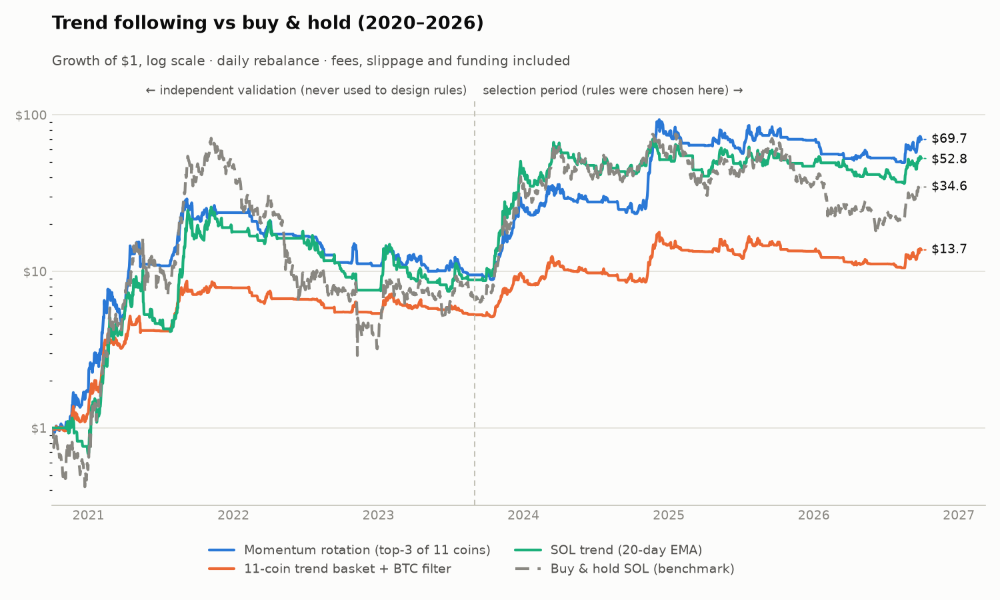
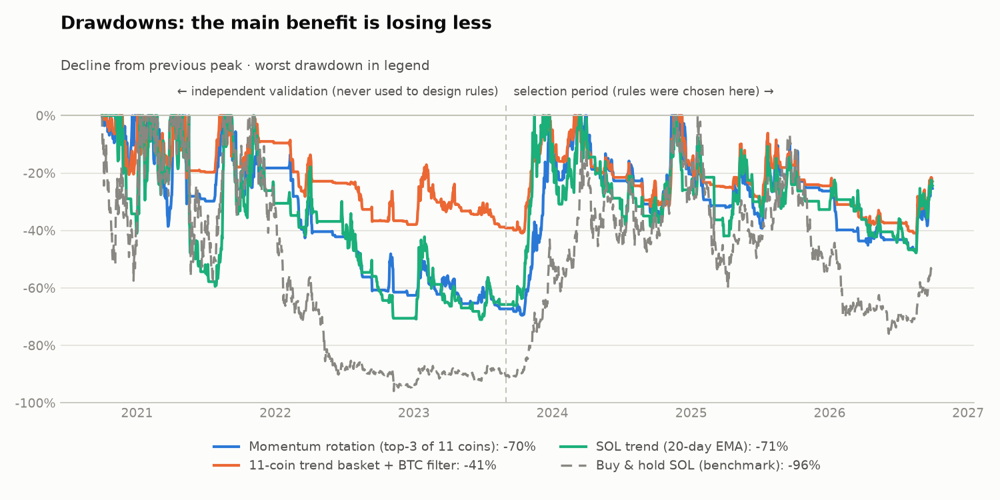
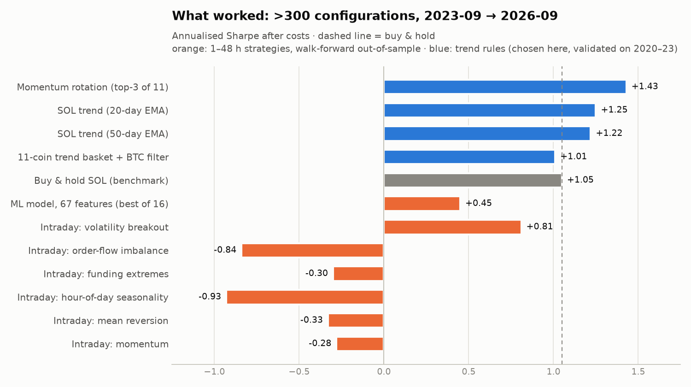
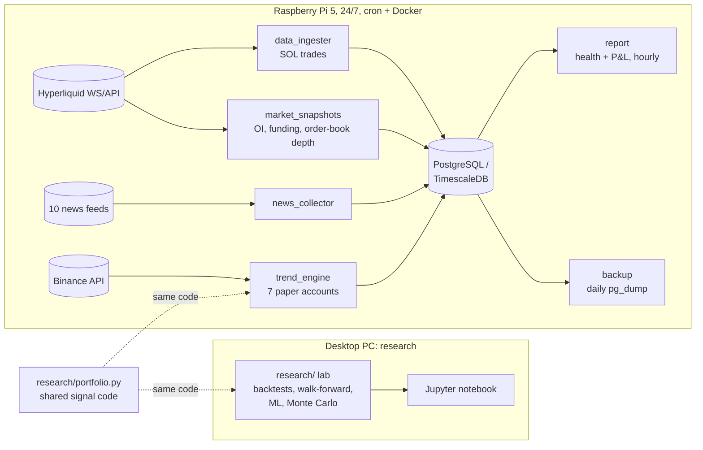

# SOL Trading Bot: systematic crypto research, from a Raspberry Pi

[](https://github.com/Elfumigador7/sol-trading-bot/actions/workflows/tests.yml)

An end-to-end quantitative trading system built on a Raspberry Pi 5 plus a desktop PC. It
collects market data 24/7, runs a research lab that tests strategies from academic papers
**without fooling itself**, and paper-trades the only approach that survived.

> **Status:** paper trading only (no real money). Not financial advice.
> Documentation in Spanish: [project state & results](docs/ESTADO_BOT.md) · [project history](docs/HISTORIA.md).

## TL;DR

- **Tested 300+ strategy configurations** at 1–48 h horizons: intraday momentum, mean reversion,
  hour-of-day seasonality, funding-rate extremes, order-flow imbalance, volatility breakouts, and a
  gradient-boosting model with 67 features. After realistic costs, **none beat buy & hold.** The ML
  model's out-of-sample AUC was 0.49–0.51, which is chance.
- **What worked: trend following.** A momentum rotation across 11 coins with a BTC regime filter
  beat buy & hold both in the period where the rules were chosen and in an **independent period
  never used for design** (2020–23, including the 2021 bull run and the 2022 crash).
- **The robust benefit is smaller drawdowns, not guaranteed higher returns.** The same rules on 11
  traditional ETFs (2007–2026) cut drawdowns in 10 of 11 assets, while returns improved only where
  trends are strong.
- Started from a notebook claiming **91 % accuracy**, which turned out to be data leakage (its own
  cross-validation showed 42 %). The whole project is built around not repeating that mistake.




## Results

| Strategy | Selection period 2023-09 → 2026-09 | Independent validation 2020-10 → 2023-08 |
|---|---|---|
| | return · Sharpe · max drawdown | return · Sharpe · max drawdown |
| **Momentum rotation** (top-3 of 11 coins, trend + BTC filter) | +634 % · **1.43** · −48 % | +850 % · **1.37** · −69 % |
| **11-coin trend basket** + BTC filter | +160 % · 1.01 · −41 % | +430 % · **1.37** · **−40 %** |
| SOL trend (20-day EMA) | +498 % · 1.25 · −50 % | +783 % · 1.23 · −73 % |
| *Buy & hold SOL (benchmark)* | *+417 % · 1.05 · −78 %* | *+602 % · 1.18 · −97 %* |

All figures include taker fees, slippage and perpetual funding, with daily rebalancing at 00:00 UTC.
The coin universe is the **top-20 of January 2023**, not today's winners, to avoid survivorship bias.
All 27 neighbouring parameter sets of the rotation beat buy & hold in the independent period
(median Sharpe 1.58).



**Honest expectations** (block-bootstrap Monte Carlo, 10,000 simulated years, excluding the 2021
mania): median one-year return of about +13 % for the rotation, with a 42 % chance of losing money
in any given year. The edge shows up over several years, and mostly as avoided crashes. For
example, the 11-coin basket had a 3 % chance of a drawdown above 50 %, versus 80 % for holding SOL.

## Live experiments (paper trading)

- **News risk brake.** A copy of the rotation that drops a coin for 72 h after a high-impact negative
  headline (hack, exploit, outage, lawsuit, delisting…), plus an hourly emergency exit. The rules were
  fixed before seeing any result, are unit-tested, and live in `scripts/news_rules.py`. It can't be
  backtested (no timestamped news history), so it is measured live against the plain rotation.
  Headlines from 10 feeds are also sentiment-scored (VADER + crypto lexicon), to be used as features later.
- **Monthly self-training with a promotion gate.** A meta-labeling model (López de Prado) learns when to
  trust each rotation pick. It is retrained monthly on all data and **promoted to paper only if** it beats
  the plain rotation out-of-sample in the full period *and* in every sub-period, with no worse drawdown
  and a Deflated Sharpe ≥ 0.95 counting **every variant ever tried** (a persistent trial registry).
  First run: AUC 0.543. It halved the max drawdown (−37 % vs −71 %) but was worse in 2023–26
  (Sharpe 1.16 vs 1.43), so it was **not promoted**.
- **Web dashboard** on the Pi's LAN: health, equity and drawdown per account, positions, degradation
  alarms (drawdown worse than anything seen in backtests), news alerts and sentiment, and Hyperliquid
  market depth.

## Methodology: how not to fool yourself

| Pitfall | Safeguard in this repo |
|---|---|
| Look-ahead bias | Every feature uses only data up to its bar's close. A unit test recomputes features on truncated data, and a mutation test confirms it catches a leaking feature |
| Random train/test splits on time series | Walk-forward only: train on the past, test on the following month, **purging** overlapping labels |
| Ignoring costs | Taker fees, slippage, funding, and a conservative limit-order fill model with **adverse selection** (fills only when price trades through; missed trades are lost) |
| Luck from testing many ideas | **Deflated Sharpe Ratio** (Bailey & López de Prado) over every configuration tried; robustness grids over neighbouring parameters |
| Selection bias | Rules chosen on 2023–26, then validated unchanged on 2020–23 |
| Survivorship bias | Universe fixed as of January 2023 |
| Backtest ≠ live | Live signals recomputed from live APIs and checked against the backtest (30 days × 7 accounts, 0 differences) |
| "Chasing the best strategy" | Simulated re-selecting the best performer monthly without hindsight: worse than fixed rules |

## Architecture



The strategy logic lives in one module (`research/portfolio.py`) used by both the backtests and the
live engine, so research and production cannot drift apart.

## Repository layout

```
scripts/            Live system on the Pi
  trend_engine.py     daily paper-trading engine (7 accounts, 11 coins)
  data_ingester.py    Hyperliquid trade stream → DB (heartbeat, reconnect, dedup)
  market_snapshots.py open interest / funding / order-book depth every 5 min
  news_collector.py   10 RSS/Atom feeds → DB, tagged by coin
  report.py           hourly health check, degradation alarms, account table
  panel.py            web dashboard (Chart.js), served on the LAN by panel_server.py
  monthly_research.py monthly self-training with a promotion gate and trial registry
  news_rules.py       news alert rules and sentiment scoring (shared, unit-tested)
  ws_utils.py         WebSocket with heartbeat and exponential-backoff reconnect
research/           Research lab (runs on the Pi or the PC)
  lab.py              backtester: costs, maker/taker fills, walk-forward, Deflated Sharpe
  strategies.py       paper-based intraday strategies with parameter grids
  features_h.py       67 hourly features (market structure, positioning, cross-asset, sentiment)
  ml.py               triple-barrier labels, walk-forward gradient boosting
  portfolio.py        multi-coin trend / momentum portfolios (shared with live engine)
  meta.py             meta-labeling on the rotation (walk-forward, monthly retraining)
  data.py, live_data.py  historical and live data loaders (Binance, Hyperliquid, GDELT, …)
  run_lab.py, run_ml.py, make_figures.py, laboratorio_estrategias.ipynb
tests/              pytest suite (offline, synthetic data), run in CI
docs/               state & results, project history (Spanish), figures
legacy/             original template and the first Jupyter → ONNX pipeline, kept for history
```

## Tech stack

Python 3.11 · pandas / NumPy / SciPy · scikit-learn (HistGradientBoosting) · ONNX / onnxruntime ·
asyncio + websockets · asyncpg + PostgreSQL / TimescaleDB (Docker) · matplotlib · pytest ·
GitHub Actions · cron · Raspberry Pi OS · REST/WebSocket APIs (Hyperliquid, Binance, GDELT, RSS).

## Running it

```bash
cp .env.example .env               # fill in DB credentials
docker-compose up -d               # PostgreSQL / TimescaleDB
python -m venv venv && venv/bin/pip install -r requirements.txt
./bot.sh start                     # data ingester (watchdog via cron)
venv/bin/python scripts/trend_engine.py --force   # first paper-trading run
./bot.sh status                    # health + accounts

# Research (downloads history on first run)
cd research && python run_lab.py && python run_ml.py && python make_figures.py

# Tests
pip install -r requirements-dev.txt && pytest -q tests
```

The cron schedule used on the Pi is documented in [`docs/ESTADO_BOT.md`](docs/ESTADO_BOT.md).

## What I would do next

- Several months of live paper trading to compare against the backtest, with review criteria fixed
  in advance.
- Compare the lexicon sentiment with FinBERT (RTX 3060) once months of headlines have accumulated.
- Execution on Hyperliquid testnet via the official SDK (signed orders, size and daily-loss limits,
  kill switch).

## License

[MIT](LICENSE)
